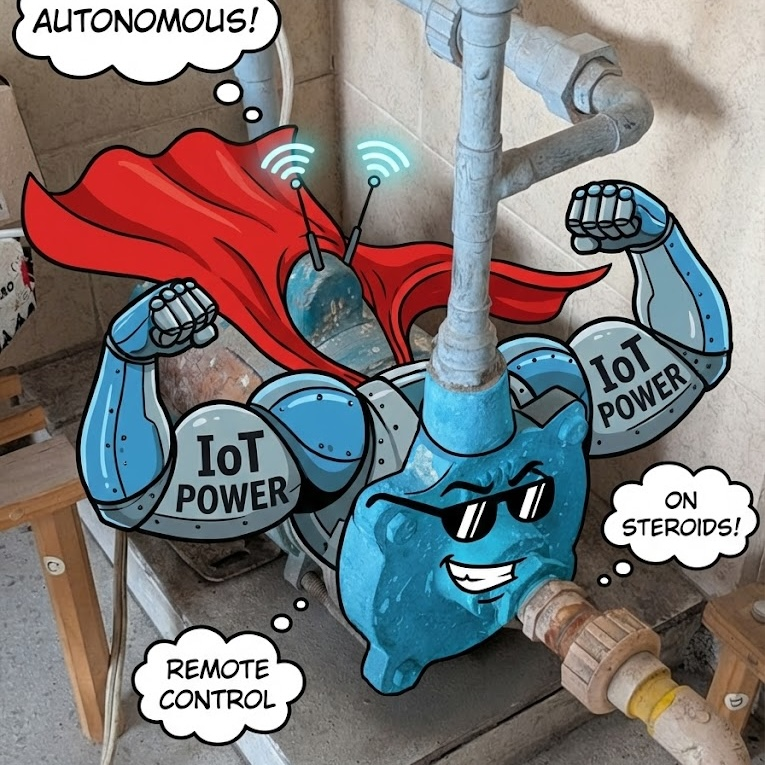

<p align="center">
  <picture>
    
  </picture>
  <br/>
  <br/>
</p>

# Water Flow Automation

Small home automation system to keep a water tank filled automatically, with manual control from a mobile-friendly dashboard.

## What this project does

- Reads tank level from a sensor ESP32.
- Decides when the pump should be ON/OFF on a local Flask server.
- Sends the final command to a pump ESP32 connected to the relay.
- Lets humans monitor level/history and override behavior from the dashboard.

## Responsibilities

- `tank/tank.ino` (Sensor ESP32)
  - Reads ultrasonic distance.
  - Converts distance to water level %.
  - Sends readings to `POST /api/sensor/reading`.

- `server/` (Brain + API)
  - Stores readings/events in SQLite (`server/pump.db`).
  - Runs auto logic (thresholds + safety rules).
  - Exposes API for dashboard and ESP32 devices.
  - Endpoints:
    - Pump: `/api/pump/command`, `/api/pump/status`, `/api/pump/override`, `/api/pump/timer`
    - Sensor: `/api/sensor/reading`, `/api/sensor/latest`, `/api/sensor/config`, `/api/sensor/history`

- `pump/pump.ino` (Pump ESP32)
  - Polls `GET /api/pump/command`.
  - Turns relay pin ON/OFF accordingly.
  - Applies local fail-safe timeout if server is unreachable.

- `dashboard/` (React + Vite UI)
  - Control tab: live tank level, mode, overrides, timer.
  - History tab: daily/hourly level charts.
  - Calls backend through `/api/*` (Vite proxy to `localhost:3001` in dev).

## System flow

`Tank Sensor ESP32 -> Flask API/SQLite -> Pump Logic -> Pump ESP32`  
`Dashboard <-> Flask API`

## Quick start

### 1) Run backend (Flask)

```bash
cd server
python3 -m venv .venv
source .venv/bin/activate
pip install -r requirements.txt
python main.py
```

Backend runs on `http://localhost:3001`.

### 2) Run dashboard

```bash
cd dashboard
npm install
npm run dev
```

Dashboard runs on `http://localhost:5173`.

### 3) Flash both ESP32 sketches

- Flash `tank/tank.ino` to the sensor board.
- Flash `pump/pump.ino` to the relay/pump board.
- In both files, set:
  - `WIFI_SSID`
  - `WIFI_PASSWORD`
  - `SERVER_IP` (machine running Flask server)

## Project structure

```text
water-flow/
├── dashboard/     # React UI (control + history)
├── server/        # Flask API, pump logic, SQLite persistence
├── tank/          # ESP32 sensor firmware (water level readings)
└── pump/          # ESP32 pump firmware (relay control)
```

## Notes

- Auto control thresholds/safety are defined in `server/app/pump_state.py`.
- If you add dashboard to home screen on mobile, it uses `dashboard/pump-logo.jpg` as app icon.
